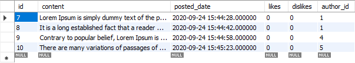
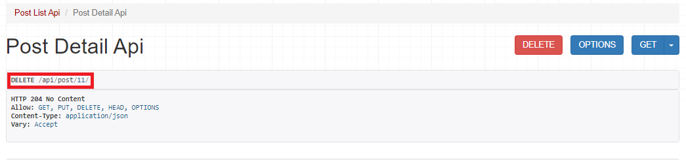
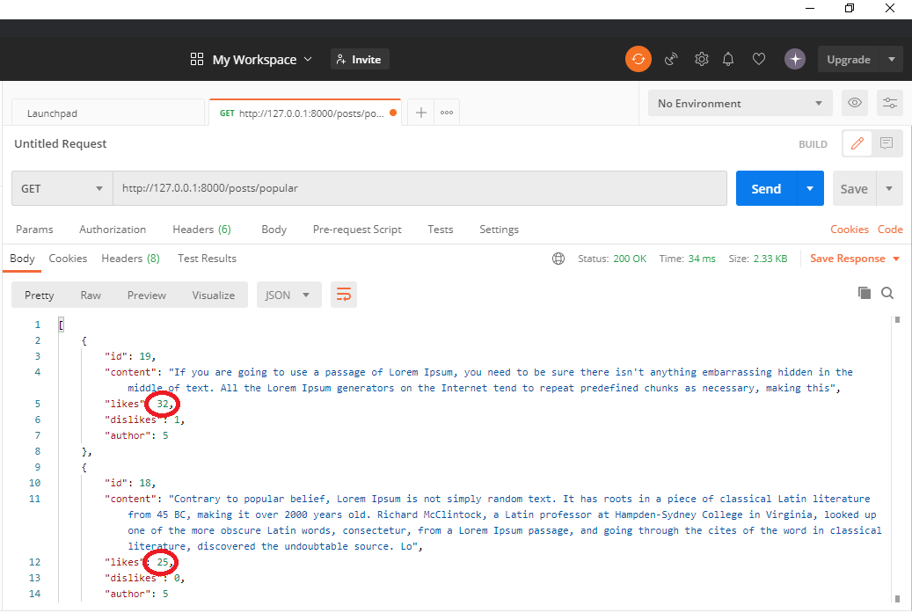
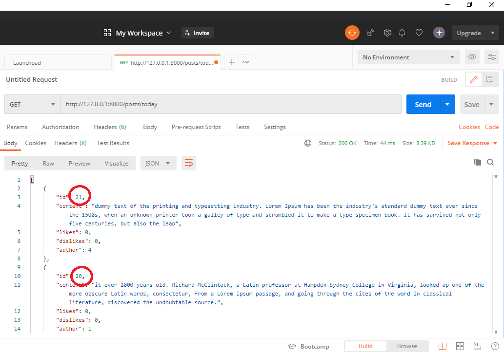
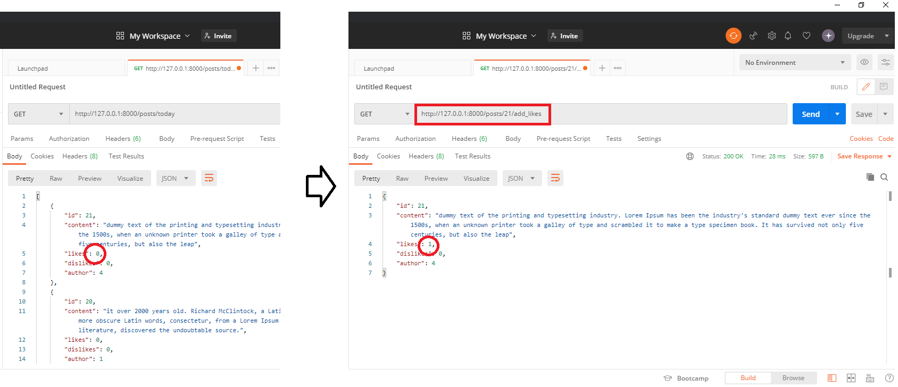

# django-rest-framework-12th

## 유의사항
* 본 레포지토리는 백엔드 스터디 2-3주차의 과제를 위한 레포입니다.
* 따라서 해당 레포를 fork 및 clone 후 local에서 본인의 깃헙 ID 브랜치로 작업한 후 커밋/푸시하고,
PR 보낼 때도 `본인의 브랜치-> 본인의 브랜치`로 해야 합니다.

## 2주차 과제 (기한: 9/26 토요일까지)
노션 링크 (https://www.notion.so/2-Django-ORM-c46e2d2f88ac4d948d012c07605d8e03)

-------------------------

### 서비스 설명
twitter

좋아요를 누르고 댓글을 달고 follow하는 등등의 sns 방식이 많은 앱 기획에서 구현하고 싶어하는 기본 요소여서, 가장 간단한 형식의 sns라고 생각되는 twitter를 copy해보려고 한다.

### 모델 설명
- model 구조

```
- AlphaTechnic
	- api
		- Post
		- Comment
		- Preference
	- users
		- Profile
		- Follow
```


- api

```python
from django.db import models
from django.utils import timezone
from django.contrib.auth.models import User


class Post(models.Model):
    content = models.TextField(max_length=1000)
    posted_date = models.DateTimeField(default=timezone.now)
    author = models.ForeignKey(User, on_delete=models.CASCADE) # 장고의 User 모델을 이용
    likes = models.IntegerField(default=0)       ## Post가 가지고 있는 좋아요, 싫어요
    dislikes = models.IntegerField(default=0)

    def __str__(self):
        return self.content[:15] + '...'  # Post 객체의 content가 앞 15자만 보여지도록. 

    def num_of_comments(self):      ## 해당 Post 객체가 가지고 있는 comment 수를 알려줌. 
        return Comment.objects.filter(connected_post=self).count()
    
    @property  ## 외부에서 post_obj.comments하면 post_obj의 comment들이 조회되도록(마치 Profile객체가 가진 속성인 것처럼) @property를 이용하여 getter를 구현
    def comments(self):
        return Comment.objects.filter(connected_post=self)


class Comment(models.Model):
    ## Post : Comment = 1 : N 관계가 되도록 Post를 외래키로 지정
    connected_post = models.ForeignKey(Post, on_delete=models.CASCADE)
    content = models.TextField(max_length=150)
    posted_date = models.DateTimeField(default=timezone.now)
    author = models.ForeignKey(User, on_delete=models.CASCADE)

    def __str__(self):  ## object가 조회되었을 때, 보여지는 string 형식을 지정
        return self.content[:15] + '.. -> ' + str(self.connected_post)[:8] + '..'


class Preference(models.Model):
    user = models.ForeignKey(User, on_delete=models.CASCADE)
    post = models.ForeignKey(Post, on_delete=models.CASCADE)
    likes = models.IntegerField(default=0)
    date = models.DateTimeField(auto_now=True)

    def __str__(self):
        return str(self.user) + '.. : ' + str(self.post) + ' : \"' + str(self.likes) + '\" likes'

```


- users

```python
from django.db import models
from django.contrib.auth.models import User
from PIL import Image ## image를 재가공할 수 있는 패키지 설치


class Profile(models.Model):  # profile
    user = models.OneToOneField(User, on_delete=models.CASCADE)
    image = models.ImageField(default='default.png', upload_to="users/profile_pic")
    ## 이미지 등록 안했을 경우의 default 이미지를 설정해줌.

    def __str__(self):
        return f'{self.user.username} Profile'

    @property  
    def followers(self):
        return Follow.objects.filter(follow_user=self.user).count()

    @property
    def following(self):
        return Follow.objects.filter(user=self.user).count()

    def save(self, force_insert=False, force_update=False, using=None, update_fields=None):
        super().save()

        ## 이미지 사이즈를 300*300으로 재가공하여 저장하기 위한 작업
        img = Image.open(self.image.path)
        if img.height > 300 or img.width > 300:
            size = (300, 300)
            img.thumbnail(size)
            img.save(self.image.path)


class Follow(models.Model):
    ## User를 통해 user 혹은 follow_user를 역참조하기 위한 related_name 설정
    user = models.ForeignKey(User, related_name='user', on_delete=models.CASCADE) # 이름을 좀더 명확히
    follow_user = models.ForeignKey(User, related_name='follow_user', on_delete=models.CASCADE) 
    date = models.DateTimeField(auto_now_add=True)
```


#### 관련 개념

- models.DateTimeField(`setting`) : `default=timezone.now` vs `auto_now=True` vs `auto_now_add=True`
    - `default=timezone.now` : 현재 시간을 default 값으로 저장.
        - posted_date를 이 설정으로 저장하였다. 사용자가 과거의 일기같은 것을 현재 작성하고 있는 경우, posted_date를 과거로 바꿀 수도 있을 것이다.
    - `auto_now=True` : '수정 일자'를 등록하는 데 사용. model이 save 될 때마다 현재날짜(date.today()) 로 **갱신된다.**
        - 좋아요를 누른 date를 이 설정으로 저장하였다. model을 다시 save하면, date가 갱신된다.
    - `auto_now_add=True` : '생성 일자'를 등록하는 데 사용. model을 최초 저장(insert) 시에만 현재날짜(date.today()) 를 적용한다.
        - Follow를 시작한 date를 이 설정으로 저장하였다. model이 save 되어도 date가 **갱신되지 않는다.**

- `@property` : class 내의 메서드들을 외부에서 사용할 때, 마치 '속성(attribute)'인 것처럼 사용할 수 있게하는 장치

> `getter_setter.py`

```python
class Person:
    def __init__(self):
        self.__age = 0
 
    def get_age(self):           # getter
        return self.__age
    
    def set_age(self, value):    # setter
        self.__age = value
 
james = Person()
james.set_age(20)
print(james.get_age())
## 실행 결과 20
```

> property.py

```python
class Person:
    def __init__(self):
        self.__age = 0
 
    @property
    def age(self):           # getter
        return self.__age
 
    @age.setter
    def age(self, value):    # setter
        self.__age = value
 
james = Person()
james.age = 20      # 인스턴스.속성 형식으로 접근하여 값 저장
print(james.age)    # 인스턴스.속성 형식으로 값을 가져옴
## 실행 결과 20
```


### ORM 적용해보기

```python
In [1]: from api.models import Post, Comment, Preference

In [2]: from users.models import Profile, Follow

In [3]: post_obj = Post.objects.all()[0]

In [4]: post_obj.num_of_comments()
Out[4]: 2

In [5]: post_obj.comments
Out[5]: <QuerySet [<Comment: lol!!!!!!!!!.. -> Lorem Ip..>, <Comment: What a wonderfu.. -> Lorem
Ip..>]>

In [6]: Preference.objects.all()
Out[6]: <QuerySet [<Preference: kind_user.. : It is a long es... : "3" likes>, <Preference: kind_
user.. : It is a long es... : "1" likes>]>

In [7]: profile_obj = Profile.objects.all()[0]

In [8]: profile_obj
Out[8]: <Profile: kind_user Profile>

In [9]: profile_obj.followers
Out[9]: 1

In [10]: profile_obj.following
Out[10]: 0
```


### 간단한 회고 

1. 장고의 admin 페이지가 모델들 생성, 삭제를 매우 쉽게 해주고, 조회도 정말 편하게 할 수 있어 좋다.
2. mysql workbench가 내가 생성한 모델들을 table로 보여주어서, 해당 속성에 어떻게 접근해야하는지 쉽게 알 수 있었다.
3. ForeignKey가 model을 어떻게 만들어 주는지 더 와닿게 느끼게 되었다.


### 피드백

이름을 좀 더 명확히 (related_name)

follow, followee field를 묶을 수 있도록


## 3주차 과제 (기한: 10/2 금요일까지)

----------------

### APIView 만들기

- `APIView`의 구성

    ```
    - api/post/ 에 대한 CBV
        - get : Post 목록을 가져옴.
        - post : 새로운 Post를 생성
    	
    - api/post/<int:pk> 에 대한 CBV
        - get : 해당 pk Post 내용 가져옴.
        - put : 해당 pk Post 수정
        - delete : 해당 pk Post 삭제
    ```

    

- `views.py`

```python
from .models import Post
from .serializers import PostSerializer
from rest_framework.response import Response
from rest_framework.views import APIView
from rest_framework import status
from django.shortcuts import get_object_or_404


class PostListAPIView(APIView):
    def get(self, request):
        serializer = PostSerializer(Post.objects.all(), many=True)
        return Response(serializer.data)

    def post(self, request):
        serializer = PostSerializer(data=request.data)
        if serializer.is_valid():
            serializer.save()
            return Response(serializer.data, status=201)
        else:
            return Response(serializer.errors, status=400)


class PostDetailAPIView(APIView):
    def get_object(self, pk):
        return get_object_or_404(Post, pk=pk)

    def get(self, request, pk, format=None):
        post = self.get_object(pk)
        serializer = PostSerializer(post)
        return Response(serializer.data)

    def put(self, request, pk):
        post = self.get_object(pk)
        serializer = PostSerializer(post, data=request.data)
        if serializer.is_valid():
            serializer.save()
            return Response(serializer.data)
        else:
            return Response(serializer.errors, status=status.HTTP_400_BAD_REQUEST)

    def delete(self, request, pk):
        post = self.get_object(pk)
        post.delete()
        return Response(status=status.HTTP_204_NO_CONTENT)

```


### 모델 선택 및 데이터 삽입 

(선택한 모델의 구조와 데이터 삽입 후의 결과화면을 보여주세요!)

- `models.py`

```python
from django.db import models
from django.utils import timezone
from django.contrib.auth.models import User


class Post(models.Model):
    content = models.TextField(max_length=1000)
    posted_date = models.DateTimeField(default=timezone.now)
    author = models.ForeignKey(User, on_delete=models.CASCADE)
    likes = models.IntegerField(default=0)
    dislikes = models.IntegerField(default=0)

    def __str__(self):
        return self.content[:15] + '...'

    def num_of_comments(self):
        return Comment.objects.filter(connected_post=self).count()

    @property
    def comments(self):
        return Comment.objects.filter(connected_post=self)


class Comment(models.Model):
    connected_post = models.ForeignKey(Post, on_delete=models.CASCADE)
    content = models.TextField(max_length=150)
    posted_date = models.DateTimeField(default=timezone.now)
    author = models.ForeignKey(User, on_delete=models.CASCADE)

    def __str__(self):
        return self.content[:15] + '.. -> ' + str(self.connected_post)[:8] + '..'


class Preference(models.Model):
    user = models.ForeignKey(User, on_delete=models.CASCADE)
    post = models.ForeignKey(Post, on_delete=models.CASCADE)
    likes = models.IntegerField(default=0)
    date = models.DateTimeField(auto_now=True)

    def __str__(self):
        return str(self.user) + '.. : ' + str(self.post) + ' : \"' + str(self.likes) + '\" likes'
```




### 모든 list를 가져오는 API

(API 요청한 URL과 결과 데이터를 코드로 보여주세요!)

- URL: `api/post/`
- Method: `GET`

```python
[
    {
        "id": 7,
        "content": "Lorem Ipsum is simply dummy text of the printing and typesetting industry. Lorem Ipsum has been the industry's standard dummy text ever since the 1500s, when an unknown printer took a galley of type and scrambled it to make a type specimen book. It has survived not only five centuries, but also the leap into electronic typesetting, remaining essentially unchanged. It was popularis",
        "posted_date": "2020-09-24T15:44:28",
        "likes": 0,
        "dislikes": 0,
        "author": 1
    },
    {
        "id": 8,
        "content": "It is a long established fact that a reader will be distracted by the readable content of a page when looking at its layout. The point of using Lorem Ipsum is that it has a more-or-less normal distribution of letters, as opposed to using 'Content here, content here', making it look like readable English. Many desktop publishing packages and web page editors now use Lorem Ipsum as their default model text, and a search for 'lorem ipsum' will uncover many web sites still in their infancy. Various versions have evolved over the years, sometimes by accident, sometimes on purpose (injected humour and the like)",
        "posted_date": "2020-09-24T15:44:42",
        "likes": 0,
        "dislikes": 0,
        "author": 1
    },
    {
        "id": 9,
        "content": "Contrary to popular belief, Lorem Ipsum is not simply random text. It has roots in a piece of classical Latin literature from 45 BC, making it over 2000 years old. Richard McClintock, a Latin professor at Hampden-Sydney College in Virginia, looked up one of the more obscure Latin words, consectetur, from a Lorem Ipsum passage, and going through the cites of the word in classical literature, discovered the undoubtable source. Lorem Ipsum comes from sections 1.10.32 and 1.10.33 of \"de Finibus Bo",
        "posted_date": "2020-09-24T15:44:58",
        "likes": 0,
        "dislikes": 0,
        "author": 4
    },
    {
        "id": 10,
        "content": "There are many variations of passages of Lorem Ipsum available, but the majority have suffered alteration in some form, by injected humour, or randomised words which don't look even slightly believable. If you are going to use a passage of Lorem Ipsum, you need to be sure there isn't anything embarrassing hidden in the middle of text. All the Lorem Ipsum generators on the Internet tend to repeat predefined chunks as necessary, mak",
        "posted_date": "2020-09-24T15:45:23",
        "likes": 0,
        "dislikes": 0,
        "author": 5
    }
]
```


### 특정한 데이터를 가져오는 API

(API 요청한 URL과 결과 데이터를 코드로 보여주세요!)

- URL: `api/post/<int:pk>`
- Method: `GET`

```python
{
    "id": 7,
    "content": "Lorem Ipsum is simply dummy text of the printing and typesetting industry. Lorem Ipsum has been the industry's standard dummy text ever since the 1500s, when an unknown printer took a galley of type and scrambled it to make a type specimen book. It has survived not only five centuries, but also the leap into electronic typesetting, remaining essentially unchanged. It was popularis",
    "posted_date": "2020-09-24T15:44:28",
    "likes": 0,
    "dislikes": 0,
    "author": 1
}
```


### 새로운 데이터를 create하도록 요청하는 API

(요청한 URL 및 Body 데이터의 내용과 create된 결과를 보여주세요!)

- URL: `api/post/`
- Method: `POST`
- Body: { "id": 11, "content": "새로 생성한 content 입니다", "posted_date": "2020-09-24T15:44:28", "likes": 0, "dislikes": 0, "author": 1}

```python
{
    "id": 11,
    "content": "새로 생성한 content 입니다",
    "posted_date": "2020-09-24T15:44:28",
    "likes": 0,
    "dislikes": 0,
    "author": 1
}
```


### (선택) 특정 데이터를 삭제 또는 업데이트하는 API

(위의 과제와 마찬가지로 요청 URL 및 결과 데이터를 보여주세요!)


- 삭제
	- URL: `api/post/<int:pk>`
	- Method: `DELETE`




- 업데이트
      - URL: `api/post/<int:pk>`
      - Method: `PUT`
      - Body: "{"id": 7,  "content": "새로 업데이트 한 content 입니다", "posted_date": "2020-09-24T15:44:28", "likes": 0, "dislikes": 0, "author": 1}"

```python
{
    "id": 7,
    "content": "새로 업데이트 한 content 입니다",
    "posted_date": "2020-09-24T15:44:28",
    "likes": 0,
    "dislikes": 0,
    "author": 1
}
```

  

### 공부한 내용 정리

- `ModelSerializer`를 통한 `JSON` 직렬화
    - DRF에서는 `ModelSerializer`를 통해 `JSONRenderer`에서 변환 가능한 형태로 먼저 데이터를 변환한다.
    - `Serializer`는 장고의 Form과 유사하며, `ModelSerializer`는 장고의 `ModelForm`과 유사하다.
    - 둘의 결정적인 차이는 
        - `Form`은 `html`을 생성하고
        - `Serializer`는 `JSON` 문자열을 생성하는 차이


- APIView
    - CBV 중 하나이기 때문에 URL에 대해서만 처리할 수 있다.
    - view에 여러가지 기본 설정을 부여하여, 상황에 맞춰서 커스튬하여 사용하게 된다. 
    - 요청 method에 맞게 멤버함수를 정의하면 해당 method로 request가 들어올 때 함수들이 호출 된다.


- APIViewer의 대안들
    - `@api_view` 장식자

        - FBV에 대해서 사용하는 장식자이다.

    - `Mixins` 상속

        - `APIView`를 보면 각 request method마다 직접 serializer 처리를 해주고 있다.
        - 이러한 것들을 자동으로 처리하는 기능들이 `rest_framework.mixins`에 구현되어 있다.
        - 이름이 직관적으로 구성되어있다.

    - `generics APIView`

        - `Mixin`을 상속함으로서 반복되는 내용이 많이 줄어든다.
        - 하지만, 여러가지를 상속해야하다보니 가독성이 떨어진다.
        - `rest_framework`에서는 저들을 상속한 새로운 클래스를 정의해 놓았다.

    - `ViewSet`

        - generic APIView는 코드를 상당히 많이 간소화해주지만, 아직 queryset과 serializer_class가 공통적인 데도 불구하고, 따로 기재해주어야한다.

        - 이를 ViewSet은 한번에 처리를 해준다.

        - views.py

            ```python
            from .models import Post
            from .serializers import PostSerializer
            from rest_framework import viewsets
            
            class PostViewSet(viewsets.ModelViewSet):
                queryset = Post.objects.all()
                serializer_class = PostSerializer
            ```

        - Router를 통해서 하나의 url로 처리가 가능하다.

        - urls.py

            ```python
            from django.urls import path, include
            from . import views
            from rest_framework.routers import DefaultRouter
            
            router = DefaultRouter()
            router.register('viewset',views.PostViewSet)
            
            urlpatterns = [
                path('',include(router.urls)),
            ]
            ```

            

    

### 간단한 회고

1. 웹API를 통해서 서버와 클라이언트가 요청/응답을 주고 받는다는 데,  APIViwer의 구체적인 쓰임이 어떻게 될지 아직 감이 잘 오지 않는다.
2. django admin에서 데이터 조회 및 수정, 삭제가 가능한데, 왜 번거롭게 APIViewr를 만드는 것일까..?


### 피드백

1. url 명을 posts라고 해야 RESTful한 작명이 된다.
2. README.md 내의 이미지가 github에도 올라갈 수 있게 git의 관리를 받고 있는 폴더 안에 img파일을 둔다.


## 4주차 - DRF2 : ViewSet

-----------

### Viewset

기존의 간단한 형태의 **CBV**에서는 **하나의 url에 하나의 View만을 매핑** (아래와 같음)

- 리스트 url → 리스트 view(get/post)
- 디테일 url → 디테일 view(get/post/put..)

그러나, ViewSet은 하나의 뷰가 아닌 set, 여러 개의 뷰를 만들 수 있는 확장된 CBV이다. 이것이 as_view를 통해서 뷰를 만들지 않고, router를 사용하는 이유이다. 하지만 사실, ViewSet도 as_view를 사용하여 각각의 뷰를 만들어줄 수 있다.

```python
.as_view({
	'http method': '함수'
})
```


- `ViewSet`의 종류
    
    1. `viewsets.ReadOnlyModelViewSet`
        - 목록 : `mixins.ListModelMixin` -> list() 함수
        - 특정 레코드 : `mixins.RetrieveModelMixin` -> retrieve() 함수
    2. `viewsets.ModelViewSet`
        - 목록 : `mixins.ListModelMixin` -> list() 함수
        - 특정 레코드 : `mixins.RetrieveModelMixin` : retrieve() 함수
        - 레코드 생성 : `mixins.CreateModelMixin` : create() 함수
        - 레코드 수정 : `mixins.UpdateModelMixin` : update() 함수, partial_update() 함수
    - 레코드 삭제 : `mixins.DestroyModelMixin` : destroy() 함수
    
- Router

    URL 매칭을 편리하게 할 수 있다. 기존에는 as_view를 통해 각 request method마다 대응되는 함수를 연결시켜주었다면 router는 이를 알아서 연결시켜준다. 

    ```
    - list route
    	- url: /prefix/
    	- name : {model name}-list
    	'get':'list', 'post':'create'
    	
    - detail route
    	- url : /prefix/pk/
    	- name : {model name}-detail
    	'get':'retrieve', 'put':'update', 'patch':'partial_update', 'delete':'destroy'
    ```

    Router를 사용하게 되면, Api Root를 제공해준다. 해당 app에 대한 root url로 갈 경우 Router에 등록된 ViewSet을 확인할 수 있다.

    


- Decorator `@action`

    default 매핑의 경우, list route에 대해서 2개, detail route에 대해서 4개를 매핑해주게 된다. 하지만, 실제로는 6개보다 더 많은 경우가 많다. 영화관 서비스를 예시로 하면, 

    - 예시1 ) 

        어떤 영화의 시작시간과 러닝타임을 가지고, 영화가 끝나는 시간을 response로 받아내는 액션을 만드려는 경우

    - 예시2 )

        request body에 업데이트 할 내용을 모두 넣어 update view에 접근하는 방식이 아닌, 해당 action과 매핑된 url에 접근함으로써 해당 자리가 예약되었음을 나타내는 필드만 빠르게 True로 바꾸는 액션을 만드려는 경우

    

    

    1. **detail**

        `action`은 첫번째 인자로 detail 값을 받는다. Boolean으로서 

        - True일 경우, pk 값을 지정해주어야 하며,
        - False인 경우, 목록 단위로 적용하게 된다.

        ```
        - detail=True
        	- url : /prefix/{pk}/{function name}/
        	- name : {model name}-{function name}
        
        - detail=False
        	- url : /prefix/{function name}/
        	- name : {model name}-{function name}
        ```

        

    2. **methods**

        request method를 지정해줄 수 있다. 디폴트 값은 get

    

    

 ### 과제1. ViewSet으로 리팩토링 하기

- models.py

    ```python
    from django.db import models
    from django.utils import timezone
    from django.contrib.auth.models import User
    
    
    class Post(models.Model):
        content = models.TextField(max_length=1000)
        posted_date = models.DateTimeField(default=timezone.now)
        author = models.ForeignKey(User, on_delete=models.CASCADE)
        likes = models.IntegerField(default=0)
        dislikes = models.IntegerField(default=0)
    
        def __str__(self):
            return self.content[:15] + '...'
    
        def num_of_comments(self):
            return Comment.objects.filter(connected_post=self).count()
    
        @property
        def comments(self):
            return Comment.objects.filter(connected_post=self)
    ```

- urls.py

    ```python
    from django.urls import path, include
    from . import views
    from rest_framework.routers import DefaultRouter
    
    router = DefaultRouter()
    router.register(r'posts', views.PostViewSet)
    
    urlpatterns = [
        path('',include(router.urls)),
    ]
    ```

    url이 `/posts/today/...` 이런 식으로 디렉토리를 열듯 하위구조로 내려가는 듯한 뉘앙스가 있고, 이를 살려주어야 하기에 복수형(posts)으로 작명하였다.

    

### 과제2 `@action` 추가하기

- views.py

    ```python
    from rest_framework import status
    from rest_framework.viewsets import ModelViewSet
    from rest_framework.decorators import action
    from rest_framework.response import Response
    from .models import Post
    from .serializers import PostSerializer
    import datetime
    
    
    class PostViewSet(ModelViewSet):
        queryset = Post.objects.all()
        serializer_class = PostSerializer
    
        # url : posts/popular/
        @action(detail=False)
        def popular(self, request): # 좋아요 20개 이상 받은 인기 posts
            qs = self.queryset.filter(likes__gt=20).order_by('-posted_date')[:10]
            serializer = self.get_serializer(qs, many=True)
            return Response(status=status.HTTP_200_OK, data=serializer.data)
    
        # url : posts/today/
        @action(detail=False)
        def today(self, request): # 오늘 생성된 posts
            today = datetime.date.today()
            qs = self.queryset.filter(posted_date__gt=today).order_by('-posted_date')
            serializer = self.get_serializer(qs, many=True)
            return Response(status=status.HTTP_200_OK, data=serializer.data)
    
        # url : posts/{pk}/add_likes/
        @action(detail=True, methods=['get', 'patch'])
        def add_likes(self, request, pk):  # 좋아요 하나 추가
            obj = self.get_object()
            obj.likes += 1
            obj.save()
            serializer = self.get_serializer(obj)
            return Response(status=status.HTTP_200_OK, data=serializer.data)
    
        # url : posts/{pk}/add_dislikes/
        @action(detail=True, methods=['get', 'patch'])
        def add_dislikes(self, request, pk):  # 싫어요 하나 추가
            obj = self.get_object()
            obj.dislikes += 1
            obj.save()
            serializer = self.get_serializer(obj)
            return Response(status=status.HTTP_200_OK, data=serializer.data)
    
    ```


### 실행결과

- posts/popular/



좋아요 개수가 20개 이상인 post가 조회되는 모습이다.

- posts/today/



오늘 날짜에 생성된 post들이 조회되는 모습이다. 가장 최근에 생성된 것이 맨 위에 조회된다.

- posts/{pk}/add_likes/



해당 post의 likes가 하나 증가하였다.

- posts/{pk}/add_dislikes/


해당 post의 dislikes가 하나 증가하였다.

