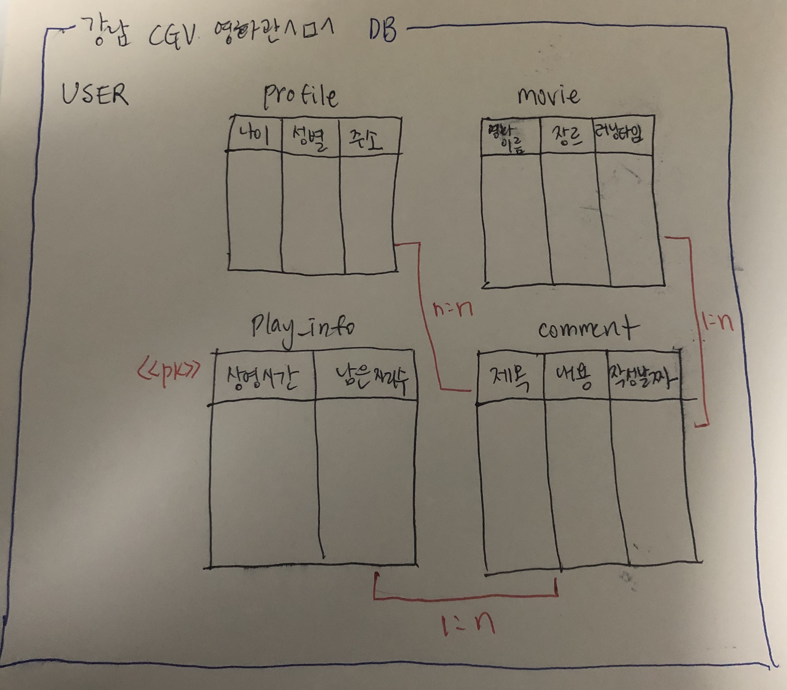

# django-rest-framework-12th

### 서비스 설명
저는 현재 강남 cgv 의 사장님입니다^ㅁ^ 제 영화관에서 여러가지 영화를 상영하는데 이를 예매하고 예매하면 예매자에 대한 정보를 DB에 입력하고, 
각 각 다른 시간대에 있는 영화들에 대한 정보 (상영 시간, 남은 자리수 등)을 보여주고 영화를 본 뒤, 사람들이 영화에 대한 
코멘트까지 남기는 서비스를 구축해보았습니다. 

### 모델 설명


제 모델은 영화 정보 및 코멘트를 달 수 있는 기능을 갖고 있습니다. 일단 profile, movie, play_info, 
그리고 comment 네가지 테이블을 생성했습니다. profile에는 예매자의 나이, 성별, 주소가 입력됩니다. USER 에 이미 id 와 이름 등은
포함 되어 있어서 상세 프로필이 들어있는 테이블을 설정하였습니다. movie 에는 영화 이름, 장르, 러닝 타임 (분으로 표시)을 포함했습니다.
다음 play_info에는 상영 시간 (예를 들어, 1시 영화, 3시 영화)와 남은 자리수를 넣어 설정하였습니다. 자리수는 임의로 총 200자리로 설정하였습니다.
comment 에는 영화 코멘트 게시글에 대한 제목, 내용과 작성 날짜를 포함했습니다. 작성 날짜는 auto_now_add를 사용해서 자동으로 입력이 될 수 있도록
설정하였습니다. 
```python
from django.db import models
from django.contrib.auth.models import User

class Profile(models.Model):
    age = models.IntegerField()
    GENDER_CHOICES = (('M', 'Male'), ('F', 'Female'))
    gender = models.CharField(max_length=20, choices=GENDER_CHOICES)
    address = models.CharField(max_length=100)
    user = models.OneToOneField(User, on_delete=models.PROTECT)

class Movie(models.Model):
    title = models.CharField(max_length=100)
    GENRE_CHOICES = (('Thriller', 'Thriller'), ('SF', 'SF'), ('Horror', 'Horror'),
                     ('Drama', 'Drama'), ('Romance', 'Romance'), ('Action', 'Action'),
                     ('Fantasy', 'Fantasy'), ('Mystery', 'Mystery'), ('Animation', 'Animation'))
    genre = models.CharField(max_length=100, choices=GENRE_CHOICES)
    running_time = models.IntegerField()

class Timetable(models.Model):
    start_time = models.DateTimeField()
    seat_left = models.IntegerField(default=200)
    movie = models.ForeignKey("Movie", on_delete=models.CASCADE, related_name="movie_play_info")
    #일단 둘 다 놔두었습니다-관련 질문이 있어서요!
    profile = models.ManyToManyField(Profile, blank=True)
    user = models.ManyToManyField(User, blank=True)

class Comment(models.Model):
    title = models.CharField(max_length=100)
    content = models.TextField()
    create_time = models.DateTimeField(auto_now_add=True)
    movie = models.ForeignKey("Movie", on_delete=models.CASCADE, related_name="comments")
```

### ORM 적용해보기
1. 데이터 베이스 해당 모델 객체 3개 넣기 


2. 퀴리셋으로 조회 


3. filter 함수 사용해보기 


### 간단한 회고 

아직 django 에 익숙치 않고 언어 숙련도가 높지 않아 정말 직관적이고 간단한 모델을 만들어보았습니다.
그래도 직접 모델링을 해보니 django 에서 모델링이라는 것이 무엇인지 조금 더 알게 된 것 같습니다. 
직접 만들어보니 좀 더 복잡하고 여러가지 테이블을 만들어 적용시켜보고 싶다는 마음이 들었는데 실력이 따라주지 않아 참 
슬프지만 그래도 직접 그려보고 그것을 구현해보니 정말 재밌었습니다. 
cgv 홈페이지에 한  들어가봤는데 정확하게 알지는 못하더라도 웹페이지를 볼 때 "1:n, n:n등을 이용해서 만들었구나" 라는 
생각을 하는 순간 뭔가 컴퓨터 공학적 관점에서 생각해보았다는 사실이 신기했고 더 배우고 싶어졌습니다! 
 
