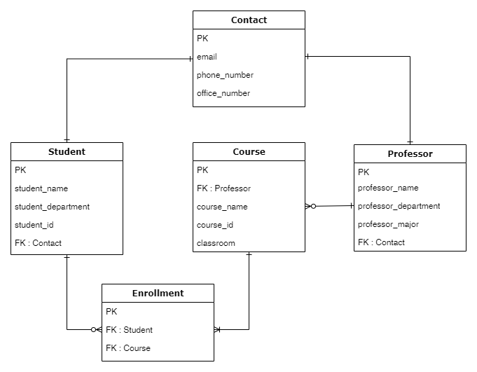

# django-rest-framework-12th

## 유의사항
* 본 레포지토리는 백엔드 스터디 2-3주차의 과제를 위한 레포입니다.
* 따라서 해당 레포를 fork 및 clone 후 local에서 본인의 깃헙 ID 브랜치로 작업한 후 커밋/푸시하고,
PR 보낼 때도 `본인의 브랜치-> 본인의 브랜치`로 해야 합니다.
 
## 2주차 과제 (기한: 9/26 토요일까지)
노션 링크 (https://www.notion.so/2-Django-ORM-c46e2d2f88ac4d948d012c07605d8e03)

### 서비스 설명
- 수강신청 서비스
- 학생 또는 교수로서 서비스에 등록할 수 있다.
- 학생의 수강신청 현황을 확인할 수 있다
- 강좌에 대한 교수의 정보를 확인할 수 있다.
- 학생과 교수의 연락처를 독자적인 테이블을 통해 확인할 수 있다.

### 모델 설명

```python
from django.db import models
from django.contrib.auth.models import AbstractBaseUser, BaseUserManager, PermissionsMixin

class StudentManager(BaseUserManager):
    use_in_migrations = True

    def student_user(self, code, name, password=None):
        if not code:
            raise ValueError('must have user id')
        if not name:
            raise ValueError('must have user name')

        user = self.model(code=code, name=name)
        user.set_password(password)
        user.save(using=self._db)
        return user

class ProfessorManager(BaseUserManager):
    use_in_migrations = True

    def create_professor_user(self, code, name, password=None):
        if not code:
            raise ValueError('must have user id')
        if not name:
            raise ValueError('must have user name')

        user = self.model(code=code, name=name)
        user.set_password(password)
        user.save(using=self._db)
        return user

class Contact(models.Model):  # 소속
    email = models.EmailField(max_length=40, null=True, blank=True)
    phone_number = models.CharField(max_length=20, null=True, blank=True)
    office_number = models.CharField(max_length=20, null=True, blank=True)


class Student(models.Model):  # 학생
    objects = StudentManager()
    student_code = models.CharField(max_length=20,verbose_name='학번')
    student_name = models.CharField(max_length=20,verbose_name='이름')
    student_department = models.CharField(max_length=20, null=True, blank=True,verbose_name='소속')
    contact = models.OneToOneField(Contact, on_delete=models.SET_NULL, null=True, blank=True)


class Professor(models.Model):  # 교수
    objects = ProfessorManager()
    professor_code = models.CharField(max_length=20,verbose_name='교수번호')
    professor_name = models.CharField(max_length=20,verbose_name='이름')
    professor_department = models.CharField(max_length=20, null=True, blank=True,verbose_name='소속')
    professor_major = models.CharField(max_length=40, null=True, blank=True)  # 교수 세부 전공
    contact = models.OneToOneField(Contact, on_delete=models.SET_NULL, null=True, blank=True)


class Course(models.Model):  # 강좌
    professor = models.ForeignKey(Professor, on_delete=models.SET_NULL, null=True, blank=True)
    course_name = models.CharField(max_length=40)
    course_code = models.CharField(max_length=20)
    classroom = models.CharField(max_length=20, null=True)


class Enrollment(models.Model):  # 수강신청, 관계테이블
    student = models.ForeignKey(Student, on_delete=models.CASCADE)
    course = models.ForeignKey(Course, on_delete=models.CASCADE)

```

### ORM 적용해보기


```
>>>Course.objects.all()
```
```
<QuerySet [<Course: Course object (1)>, <Course: Course object (2)>, <Course: Course objec
t (3)>]>
```
```p
>>>Professor.objects.filter(professor_department='CSE')
```
```
<QuerySet [<Professor: Professor object (1)>, <Professor: Professor object (2)>, <Professo
r: Professor object (3)>]>

```
```
>>> Student.objects.get(contact_id=2)
```
```
<Student: Student object (2)>
```

### 간단한 회고 
- 처음에는 데이터를 shell에서 만들어서 좀 귀찮았지만 admin 페이지가 있다는 것을 안 후에는 그것을 사용했다. user 모델 만드는 것이 좀 어려웠다. 저게 맞는지도 잘 모르겠다. 오랜만의 개발이라 너무 재미있었다.