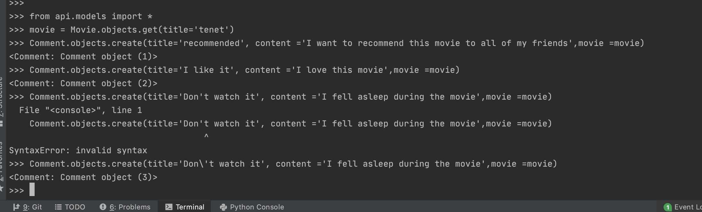
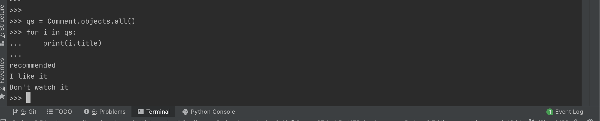
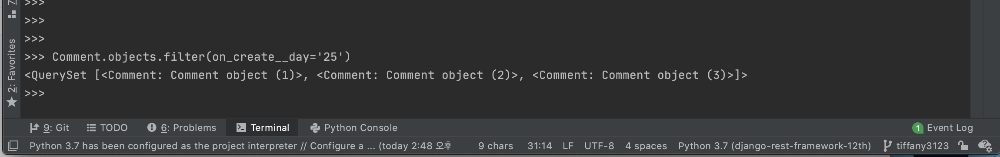
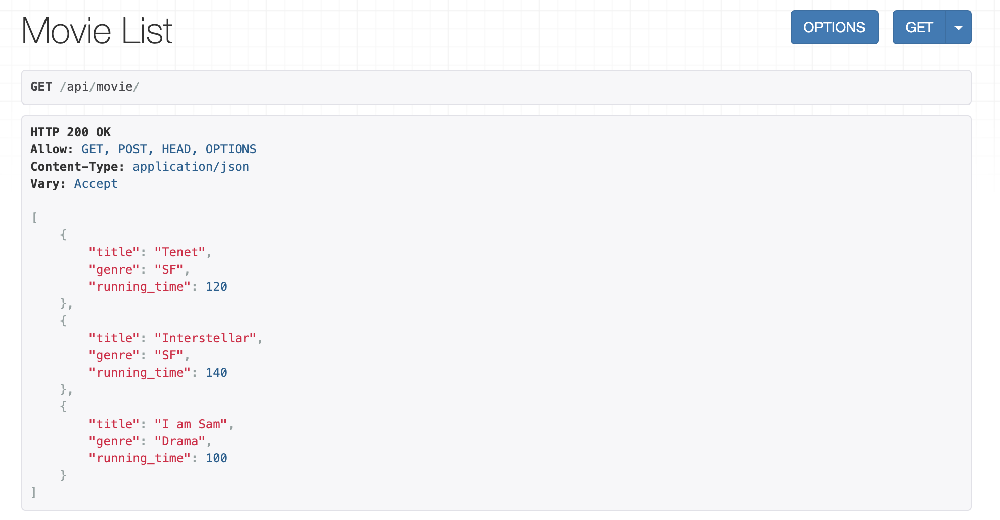
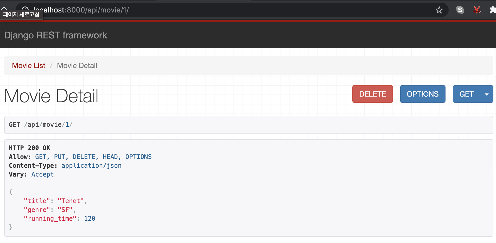
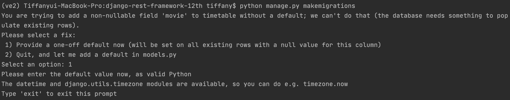

# django-rest-framework-12th

### 서비스 설명
저는 현재 강남 cgv 의 사장님입니다^ㅁ^ 제 영화관에서 여러가지 영화를 상영하는데 이를 예매하고 예매하면 예매자에 대한 정보를 DB에 입력하고, 
각 각 다른 시간대에 있는 영화들에 대한 정보 (상영 시간, 남은 자리수 등)을 보여주고 영화를 본 뒤, 사람들이 영화에 대한 
코멘트까지 남기는 서비스를 구축해보았습니다. 

### 모델 설명

제 모델은 영화 정보 및 코멘트를 달 수 있는 기능을 갖고 있습니다. 일단 profile, movie, play_info, 
그리고 comment 네가지 테이블을 생성했습니다. profile 에는 예매자의 나이, 성별, 주소가 입력됩니다. USER 에 이미 id 와 이름 등은
포함 되어 있어서 상세 프로필이 들어있는 테이블을 설정하였습니다. movie 에는 영화 이름, 장르, 러닝 타임 (분으로 표시)을 포함했습니다.
다음 timetable에는 상영 시간 (예를 들어, 1시 영화, 3시 영화)와 남은 자리수를 넣어 설정하였습니다. 자리수는 임의로 총 200자리로 설정하였습니다.
comment 에는 영화 코멘트 게시글에 대한 제목, 내용과 작성 날짜를 포함했습니다. 작성 날짜는 auto_now_add를 사용해서 자동으로 입력이 될 수 있도록
설정하였습니다. 

```python
from django.db import models
from django.contrib.auth.models import User

class Profile(models.Model):
    age = models.IntegerField()
    GENDER_CHOICES = (('M', 'Male'), ('F', 'Female'))
    gender = models.CharField(max_length=20, choices=GENDER_CHOICES)
    address = models.CharField(max_length=100)
    user = models.OneToOneField(User, on_delete=models.PROTECT)

class Movie(models.Model):
    title = models.CharField(max_length=100)
    GENRE_CHOICES = (('Thriller', 'Thriller'), ('SF', 'SF'), ('Horror', 'Horror'),
                     ('Drama', 'Drama'), ('Romance', 'Romance'), ('Action', 'Action'),
                     ('Fantasy', 'Fantasy'), ('Mystery', 'Mystery'), ('Animation', 'Animation'))
    genre = models.CharField(max_length=100, choices=GENRE_CHOICES)
    running_time = models.IntegerField()

class Timetable(models.Model):
    start_time = models.DateTimeField()
    seat_left = models.IntegerField(default=200)
    movie = models.ForeignKey("Movie", on_delete=models.CASCADE, related_name="movie_play_info")
    #일단 둘 다 놔두었습니다-관련 질문이 있어서요!
    profile = models.ManyToManyField(Profile, blank=True)
    user = models.ManyToManyField(User, blank=True)

class Comment(models.Model):
    title = models.CharField(max_length=100)
    content = models.TextField()
    create_time = models.DateTimeField(auto_now_add=True)
    movie = models.ForeignKey("Movie", on_delete=models.CASCADE, related_name="comments")
```

### ORM 적용해보기
1. 데이터 베이스 해당 모델 객체 3개 넣기 


2. 퀴리셋으로 조회 


3. filter 함수 사용해보기 


### 간단한 회고 

아직 django 에 익숙치 않고 언어 숙련도가 높지 않아 정말 직관적이고 간단한 모델을 만들어보았습니다.
그래도 직접 모델링을 해보니 django 에서 모델링이라는 것이 무엇인지 조금 더 알게 된 것 같습니다. 
직접 만들어보니 좀 더 복잡하고 여러가지 테이블을 만들어 적용시켜보고 싶다는 마음이 들었는데 실력이 따라주지 않아 참 
슬프지만 그래도 직접 그려보고 그것을 구현해보니 정말 재밌었습니다. 
cgv 홈페이지에 한  들어가봤는데 정확하게 알지는 못하더라도 웹페이지를 볼 때 "1:n, n:n등을 이용해서 만들었구나" 라는 
생각을 하는 순간 뭔가 컴퓨터 공학적 관점에서 생각해보았다는 사실이 신기했고 더 배우고 싶어졌습니다! 
 

###모델 수정 10/03

```python
class Timetable(models.Model):
    start_time = models.DateTimeField()
    movie = models.ForeignKey("Movie", on_delete=models.CASCADE, related_name="movie_play_info")
    user = models.ManyToManyField(User, blank=True)

    def count_spare_seat(self):
        MAX_SEATS = 200
        return MAX_SEATS - self.user.all().count()

class Reservation(models.Model):
    user = models.ManyToManyField(User, blank=True)
    timetable = models.OneToOneField(Timetable, on_delete=models.CASCADE, related_name="timetable_reservation")
    #어렵다.. user & reservation -> foreignkey?

class Comment(models.Model):
    title = models.CharField(max_length=100)
    content = models.TextField()
    create_time = models.DateTimeField(auto_now_add=True)
    modify_time = models.DateTimeField(auto_now=True)
    movie = models.ForeignKey("Movie", on_delete=models.CASCADE, related_name="comments")
    user = models.ForeignKey(User, on_delete=models.SET_NULL, null=True, related_name="user_comment")

```
Reservation 모델을 추가해서 timetable 모델에서는 영화 시간만을 확인하고 예약은 별개로 할 수 있게 추가하였습니다. 
Timetable 모델에서는 count_spare_seat 함수를 추가하여 최대 200자리로 설정 된 자리수에서 예약이 되면 자동으로 남은 자리수가 줄어들 수 있게 설정하였습니다.
Comment 모델에 modify_time 을 추가하였는데 이는 이후 view 에서 comment 를 수정 한 뒤 수정한 시간까지 표현할 수 있게 추가하였습니다.  

###urlpatterns 설정 

path를 두개로 나눠준 이유는 pk가 들어가느냐에 따라 달라진다. 

```python
urlpatterns = [
    path('movie/', views.MovieList.as_view()),
    path('movie/<int:pk>/', views.MovieDetail.as_view()),
    path('comment/', views.CommentList.as_view()),
    path('comment/<int:pk>/', views.CommentDetail.as_view()),
]
```

###모델 선택 및 데이터 삽입

```python
from .models import *
from rest_framework import serializers

class MovieSerializer(serializers.ModelSerializer):
    class Meta:
        model = Movie
        fields = ['title', 'genre', 'running_time']

class CommentSerializer(serializers.ModelSerializer):
    class Meta:
        model = Comment
        fields = ['title', 'content', 'create_time', 'modify_time', 'movie', 'user']
        #serializer 필드에 연결시켜준 모델도 이어줘야하는지??

```

###모든 list 를 가져오는 API

- 모든 영화 리스트를 가져오는 API
```python
class MovieList(APIView):
    #영화 리스트 조회
    def get(self, request, format=None):
        queryset = Movie.objects.all()
        serializer = MovieSerializer(queryset, many=True)
        json_data = serializer.data
        return Response(json_data)
```




- 모든 코멘트 리스트를 가져오는 API
```python
class CommentList(APIView):
    #comment 조회
    def get(self, request, format=None):
        queryset = Comment.objects.all()
        serializer = CommentSerializer(queryset, many=True)
        json_data = serializer.data
        return Response(json_data)
```
###특정한 데이터를 가져오는 API

- 특정 영화를 가져오는 API
```python
class MovieDetail(APIView):
    def get_object(self, pk):
        try:
            return Movie.objects.get(pk=pk)
        except Movie.DoesNotExist:
            raise Http404

    #특정 영화 조회
    def get(self, request, pk):
        movie = self.get_object(pk)
        serializer = MovieSerializer(movie)
        return Response(serializer.data)
```


- 특정 코멘트를 가져오는 API 
```python
class CommentDetail(APIView):
    def get_object(self, pk):
        try:
            return Comment.objects.get(pk=pk)
        except Comment.DoesNotExist:
            raise Http404

    #특정 코멘트 조회
    def get(self, request, pk):
        comment = self.get_object(pk)
        serializer = MovieSerializer(comment)
        return Response(serializer.data)
```

###새로운 데이터를 create 하도록 요청하는 API

- 새로운 영화 생성 
```python 
class MovieList(APIView):
    #영화 생성
    def post(self, request, format=None):
        serializer = MovieSerializer(data=request.data)
        if serializer.is_valid():
            serializer.save()
            return Response(serializer.data, status=status.HTTP_201_CREATED)
        return Response(serializer.errors, status=status.HTTP_400_BAD_REQUEST)
```

- 새로운 코멘트 생성 
```python
class CommentList(APIView):
    #comment 생성
    def post(self, request, format=None):
        serializer = CommentSerializer(data=request.data)
        if serializer.is_valid():
            serializer.save()
            return Response(serializer.data, status=status.HTTP_201_CREATED)
        return Response(serializer.errors, status=status.HTTP_400_BAD_REQUEST)

```

###특정 데이터를 삭제 또는 업데이트 하는 API

- 영화 정보 삭제 (상영 기간이 지났을 때)
```python
 #특정 영화 정보 삭제
    def delete(self, request, pk, format=None):
        queryset = self.get_object(pk)
        queryset.delete()
        return Response(status=status.HTTP_204_NO_CONTENT)
```

- 특정 코멘트 삭제 

```python
    #특정 코멘트 삭제
    def delete(self, request, pk, format=None):
        queryset = self.get_object(pk)
        queryset.delete()
        return Response(status=status.HTTP_204_NO_CONTENT)
```

###공부한 내용 정리 

<Django View 란?>
 사용자가 요청 했을 때 응답을 해주는 코드를 작성하는 것 
 - 가장 쉽게 만드는 법: 함수를 정의해서 함수 기반으로 만드는 것 
 장점: 파이썬 코드를 짜듯이 넣고 빼는 것에 자유로움 
 단점: 길이가 너무 길어질 수 있음, 비효율적 
 
<CBV>: 클래스 기반으로 만드는 것. 클래스는 상속을 통해 만들 수 있어서 Django 에서 이미 만들어 놓은 것을 통해 여러 기능을 구현 할 수 있다.

<Django Framework?> View 를 통해서 get (읽고), post (만들고), put (수정), delete (삭제) 할 수 있음. 

<Serialization>
Serializer은 왜 필요할까? 데이터 베이스에 django를 이용해 꺼내오면 파이썬 객체/qs 형태로 읽어오는 것
인터넷을 통해 사용자에게 전달 해야 한다면 json 이라는 포맷으로 바꿔야 함. 바꾸는 과정을 serialization 이라고 한다. 
반대는 deserialization 이라고 한다. 

<Url>
2단계로 나뉘는데,
1) api_server/urls.py 에 명시해주는 것. 
    path('api'/, include('api.urls')) 라고 쓰면 api 앱 안에있는 urls라는 파일로 연결하겠다는 것. 
2) 앱 레벨 안에 있는 urls 에 가서 설정을 해준다. 

**if serializer.is.valid(): => 사용자가 전달해준 정보가 문제가 있는지 없는지 확인하는 코드 라인, 명시한 필드에 대한 데이터가 다 있는지 등을 확인 
예를 들어 내 경우에선, 영화 이름을 안 넣고 입력했을때...그 때 서버에서 이 오류를 잡아서 데이터베이스에 저장이 되지 않게 하는것

**serializer.save() => 데이터베이스에 저장 

**url 주소에 입력하면 무조건 get을 가져오기 때문에 get만 테스트 할 수 있음
1) 그래서 나머지를 test할 수 있는 방법은 postman 이라는 툴을 씀 (일반적 방법)
2) rest framework에서 제공해주는 기능으로 자체 템릿에서 모든 기능을 테스트 할 수 있음 

**status.HTTP 에서..
2로 시작하면 잘 한 
3으로 시작하면 redirect라고 해서 서버 안에서 요청을 다시 해주는 것 
  - 서버가 바뀌거나 수정된 경우에 사용됨
  - 예전 쓰던 사용자가 수정 전 url을 넣어도 수정 된 url로 redirect 하는 것 
4로 시작하면 유저 입력 잘못이라는 것 

###질문 
1. 
```python
class Reservation(models.Model):
    user = models.ManyToManyField(User, blank=True)
    timetable = models.OneToOneField(Timetable, on_delete=models.CASCADE, related_name="timetable_reservation")
    #어렵다.. user & reservation -> foreignkey?
```
2. migration 단계 에러



3. 수정 혹은 추가 할 때 list 형태로 넘어오는 것도 할 수 있을것?....여러개의 데이터를 한번에 넣을 수 있는지...?

###간단한 회고

중간에 view 를 추가하다가 모델을 수정하고 추가하는 과정을 거쳤는데 migration 에서 자꾸 에러가 떠서 db 를 모두 drop하고 다시 만드는
고생을 했습니다. 여기서 알게 된 점은 모델링이 정말 중요하다는 것..모델링이 탄탄하지 않으면 view 단계에서 다시 수정해야하는 번거로움이
있다는 것을 알게 되었습니다. 

view 추가 까지 해보니 힘든데 재밌어서 뿌듯했어요. 