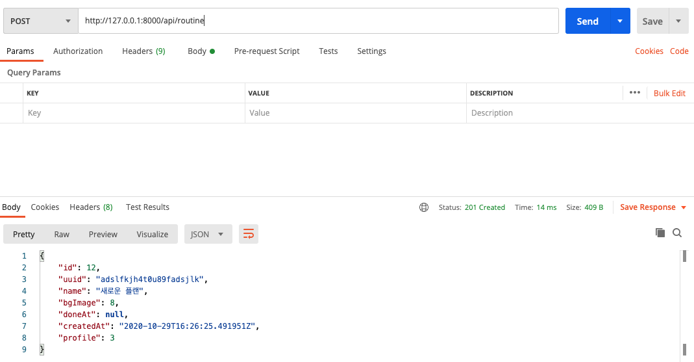
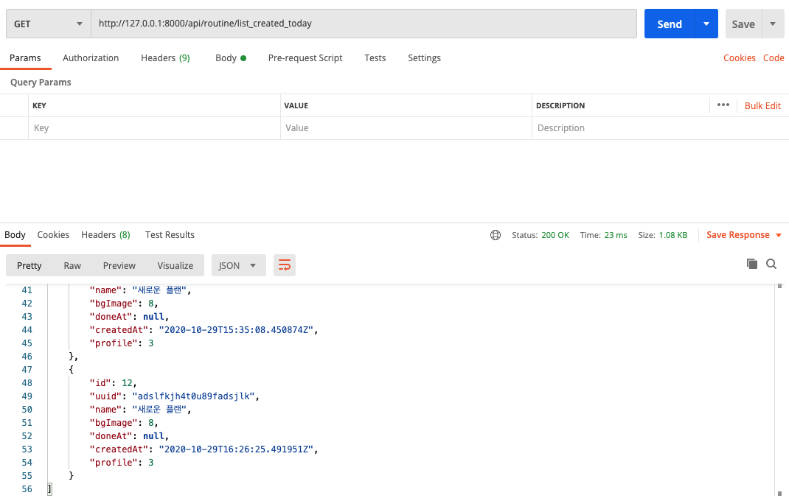

# django-rest-framework-12th

## 유의사항
* 본 레포지토리는 백엔드 스터디 2-3주차의 과제를 위한 레포입니다.
* 따라서 해당 레포를 fork 및 clone 후 local에서 본인의 깃헙 ID 브랜치로 작업한 후 커밋/푸시하고,
PR 보낼 때도 `본인의 브랜치-> 본인의 브랜치`로 해야 합니다.
 
## 2주차 과제 (기한: 9/26 토요일까지)
노션 링크 (https://www.notion.so/2-Django-ORM-c46e2d2f88ac4d948d012c07605d8e03)

### 서비스 설명
운동 플랜을 계획하고 이를 기록하는 서비스입니다.

### 모델 설명
Profile, Routine, History, MyTraining 4개의 모델을 생성했습니다.
- Profile
   - 유저의 정보가 담긴 모델입니다.
- Routine
    - 운동 플랜을 저장하는 모델입니다. 
    - Profile을 foreign key로 가집니다.
    - routineId와 data를 필드로 가집니다.
- History
    - 운동 기록을 저장하는 모델입니다.
    - Profile을 foreign key로 가집니다.
    - HistoryId와 data를 필드로 가집니다.
- MyTraining
    - 플랜 단위가 아닌 운동 단위로 기록해야할 것을 저장하는 모델입니다.
    - Profile을 foreign key로 가집니다.
    - myTrainingId와 data를 필드로 가집니다.
    
### ORM 적용해보기
shell에서 작성한 코드와 그 결과를 보여주세요! 
```mysql
# 유저 생성
>>> from django.contrib.auth.models import User
>>> User.objects.all()
<QuerySet []>
>>> User.objects.create(username='kkirru')
<User: kkirru>
>>> User.objects.all()
<QuerySet [<User: kkirru>]>

# Profile 모델 생성
>>> from api.models import Profile
>>> Profile.objects.create(user_id = 1, device_uid='fads5413', firebase_uid='fadslkj325978ajfs')
<Profile: Profile object (2)>
>>> Profile.objects.all()
<QuerySet [<Profile: Profile object (2)>]>
>>> Profile.objects.get(user_id=1)
<Profile: Profile object (2)>

# Routine 모델 생성
>>> from api.models import Routine
>>> Routine.objects.all()
<QuerySet []>
>>> Routine.objects.create(profile=me, routine_id=1, data='{name:"routine1"}')
<Routine: Routine object (1)>
>>> Routine.objects.create(profile=me, routine_id=2, data='{name:"routine2"}')
<Routine: Routine object (2)>
>>> Routine.objects.create(profile=me, routine_id=3, data='{name:"routine3"}')
<Routine: Routine object (3)>
>>> Routine.objects.all()
<QuerySet [<Routine: Routine object (1)>, <Routine: Routine object (2)>, <Routine: Routine object (3)>]>

# filter 함수 사
>>> Routine.objects.filter(profile=me)
<QuerySet [<Routine: Routine object (1)>, <Routine: Routine object (2)>, <Routine: Routine object (3)>]>
>>> Routine.objects.filter(routine_id=2)
<QuerySet [<Routine: Routine object (2)>]>
```


### 간단한 회고 
models.py를 작성할 때 데이터 타입 같은 것들을 일일이 찾아보는 과정이 쉽지 않았습니다!  
db 툴에서 드랍다운 등을 이용해서 테이블을 만드는 과정에 익숙해서 그런 것 같습니다.  
익숙해진다면 이런 방식으로 모델을 생성하고 db에 적용하는 방식이 더 편하게 느껴질 수 있을 것 같습니다!


## 3주차 과제 (기한: 10/3 토요일까지)
[과제 안내 노션](https://www.notion.so/3-DRF1-API-View-6d49c6ad888d4f249ffb52f0885c66d7)

### 모델 선택 및 데이터 삽입
선택한 모델의 구조와 데이터 삽입 후의 결과화면을 보여주세요!

선택한 모델(Routine) 구조
```python
class Routine(models.Model):
    profile = models.ForeignKey('Profile', on_delete=models.CASCADE, related_name='routines')
    uuid = models.CharField(max_length=128)
    name = models.CharField(max_length=128, null=True, blank=True)
    bgImage = models.IntegerField(default=0)
    doneAt = models.DateTimeField(null=True, blank=True)

    def __str__(self):
        return self.name
```

3개의 데이터 삽입 


### 모든 list를 가져오는 API
- Request URL : http://127.0.0.1:8000/api/routine/  
- METHOD : GET  
- Result : 
```json
[
    {
        "id": 4,
        "uuid": "asfdlkjasdflkj",
        "name": "이분할 루틴",
        "bgImage": 3,
        "doneAt": null,
        "profile": 3
    },
    {
        "id": 5,
        "uuid": "afljkfdsalkjfdsajlk",
        "name": "Strong lift 5x5",
        "bgImage": 5,
        "doneAt": null,
        "profile": 3
    },
    {
        "id": 6,
        "uuid": "dsajklt42u90",
        "name": "Jim Wendler 531",
        "bgImage": 8,
        "doneAt": null,
        "profile": 3
    }
]
```
  
- 3개의 목록이 잘 가져와졌다. id가 4부터 시작하는 이유는 앞서 생성한 루틴이 삭제되었기 때문
- admin에서 profile을 선택했기 때문에 profile : 3을 여기서 이해하지 못했다.
    - 왜 객체가 아니라 3이 뜨지..?


### 특정한 데이터를 가져오는 API
- Request URL : http://127.0.0.1:8000/api/routine/5  
- METHOD : GET  
- Result : 

```json
{
    "id": 5,
    "uuid": "afljkfdsalkjfdsajlk",
    "name": "Strong lift 5x5",
    "bgImage": 5,
    "doneAt": null,
    "profile": 3
}
```

### 새로운 데이터를 create하도록 요청하는 API
URL : http://127.0.0.1:8000/api/routine/  
METHOD : POST  
Body : 
```
uuid:adslfkjh4t0u89fadsjlk
name:새로운 플랜
bgImage:8
doneAt:
profile:3
```
Result : 
```json
{
    "id": 7,
    "uuid": "adslfkjh4t0u89fadsjlk",
    "name": "새로운 플랜",
    "bgImage": 8,
    "doneAt": null,
    "profile": 3
}
```

- create을 해야 할때 4개의 필드는 단순한 데이터지만 profile은 객체이기에 어떻게 값을 전달해야할지 혼란이 왔다.
    - 그냥 pk를 입력해주면 되는 것이었다
    - 'profile : 3'의 3이 pk인 것을 여기서 알았다...
    - 역시 모르겠으면 일단 넘어가고 해보기 ㅎ 


### (선택) 특정 데이터를 삭제 또는 업데이트하는 API
URL : http://127.0.0.1:8000/api/routine/7   
METHOD : DELETE   
RESULT : 
```json
{
    "id": 7,
    "uuid": "adslfkjh4t0u89fadsjlk",
    "name": "새로운 플랜",
    "bgImage": 8,
    "doneAt": null,
    "profile": 3
}
```

- DELETE만 진행해보았다. CRUD가 정말 쉽다.

### 공부한 내용 정리
1. 아주 어렴풋이 알고 있던 REST API의 개념을 조금 알게 되었습니다.
- URI는 자원을 표시
- HTTP Method(Post, Get, Put, Delete)로 자원에 대 행위(CRUD) 표현

2. pk를 명시하지 않은 모델의 경우 자동으로 생성된 id가 pk가 된다.

3. Seralizer로 모델을 직렬화할 때, fk는 fk의 pk로 읽고 써진다.

### 간단한 회고
개인적으로 굉장히 재밌는 과제였습니다!  
- Serializer와 View를 만들(복붙하)고 URL mapping만 했을 뿐인데 CRUD가 구현이 된다니 놀랐습니다.
- 지금까지 URL에 routine/insert, routine/delete 등으로 행위를 담아 표현했었는데 HTTP METHOD로 깔끔하게 CRUD를 표현해보 REST API의 철학(?)을 조금은 이해한 기분이었습니다.  
- CRUD가 아니라 로그인 등 로직이 들어간 요청은 어떻게 RESTful하게 처리하는지 조금 궁금해졌습니다.


## 4주차 과제

### ViewSet으로 리팩토링
#### 1. ViewSet class
- 아래와 같이 RoutineViewSet 클래스를 정의했다.
    -```python
        class RoutineViewSet(viewsets.ModelViewSet) :
            serializer_class = RoutineSerializer
            queryset = Routine.objects.all()
        ``` 


#### 2. url mapping
- urls.py에 아래와 같이 DefaultRouter를 이용하여 url을 매핑해주었다.
    - ```python
        router = routers.DefaultRouter()
        router.register(r'routine', views.RoutineViewSet)
        
        urlpatterns = router.urls
        ```

#### 3. show_ulrs로 url mapping 확인하기
- show_urls 를 사용하려면 django_extensions를 설치해야 한다.
    - ```
        INSTALLED_APPS = [
            ...
            'django_extensions',
        ]
        ```
- url이 잘 매핑된 모습
    - ```python
        /api/routine    api.views.RoutineViewSet        routine-list
        /api/routine/<pk>       api.views.RoutineViewSet        routine-detail
        /api/routine/<pk>\.<format>/    api.views.RoutineViewSet        routine-detail
        /api/routine\.<format>/ api.views.RoutineViewSet        routine-list
        ```


#### 4. 주의점. trailing_slash
- 지난번 김지현 교수님께서 마지막 slash를 고려하는 것에 대해 말씀해주셨는데 식견이 부족하여 이해를 못했었다.
    - 그런데 ViewSet으로 리팩토링한 후 slash를 붙이지 않으면 아래와 같이 요청이 먹히지 않았다..!
    - ```
        RuntimeError: You called this URL via POST, but the URL doesn't end in a slash and you have APPEND_SLASH set. Django can't redirect to the slash URL while maintaining POST data. Change your form to point to 127.0.0.1:8000/api/routine/ (note the trailing slash), or set APPEND_SLASH=False in your Django settings.
      ```
    - 에러 내용대로 trailing_slash에 대해 처리해주어야 한다.
    - ```python
        router = routers.DefaultRouter(trailing_slash=False)
        ```
- 

### @action 추가
- 아래와 같이 오늘 추가된 루틴을 select 하는 action을 만들어봤다.
    - ```python
        class RoutineViewSet(viewsets.ModelViewSet) :
            serializer_class = RoutineSerializer
            queryset = Routine.objects.all()
        
        # add action
        @action(methods=['get'], detail=False, url_name='', url_path='')
        def list_created_today(self, request, *args, **kwargs):
            routines = Routine.objects.filter(
                createdAt__year=datetime.today().year,
                createdAt__month = datetime.today().month,
                createdAt__day = datetime.today().day
            )
            serializer = RoutineSerializer(routines, many=True)
            return Response(status=status.HTTP_200_OK, data=serializer.data)
        ```

- createdAt 필드의 시간이 아닌 날짜만 같으면 되므로 아래와 같이 3개의 조건을 필터에 써주어야 한다.
    - ```python
        routines = Routine.objects.filter(
            createdAt__year = datetime.today().year,
            createdAt__month = datetime.today().month,
            createdAt__day = datetime.today().day
        )  
        ```
    - 아니 갑자기 무슨 언더스코어 두개를 썼더니 그 datetime 필드에 있는 year, month, day에 접근이 가능하다??
        - 닥스 링크 : https://docs.djangoproject.com/en/3.1/topics/db/queries/#lookups-that-span-relationships

 - action을 추가한 후 show_urls
    - ```
        /api/routine    api.views.RoutineViewSet        routine-list
        /api/routine/<pk>       api.views.RoutineViewSet        routine-detail
        /api/routine/<pk>\.<format>/    api.views.RoutineViewSet        routine-detail
        /api/routine/list_created_today api.views.RoutineViewSet        routine-list-created-today
        /api/routine/list_created_today\.<format>/      api.views.RoutineViewSet        routine-list-created-today
        /api/routine\.<format>/ api.views.RoutineViewSet        routine-list
      ```
 - 실행 결과
    - 
    
    
 - 간단한 회고
    1. 몇 주만에 파이썬 & 장고를 보니 싸웠던 친구를 만난 것처럼 어색했다...
    2. 하지만 역시 하다보니 파이썬 갓갓 장고 갓갓.
    
    
 ## 5주차 과제
 ### 1. Filtering
 #### 단순 문자열 일치 필터링
 - ```
   # viewset
    class RoutineViewSet(viewsets.ModelViewSet):
    queryset = Routine.objects.all()
    serializer_class = RoutineSerializer
    filter_backends = [DjangoFilterBackend]
    filterset_class = RoutineFilter
   
   # Filter
   class RoutineFilter(FilterSet):
    class Meta:
        model = Routine
        fields = ['name']

    name = filters.CharFilter() 
    ```
 - ```field_name```과 ```lookup_expr```의 default는 각각 필드명과 exact이므로 단순 문자열 일치의 경우 명시할 필요 없음!
 - 이 경우 사실 class를 만들 필요까진 없고 ViewSet에서 filter_fileds만 명시해주어도 된다.
- ```
    class RoutineViewSet(viewsets.ModelViewSet):
    queryset = Routine.objects.all()
    serializer_class = RoutineSerializer
    filter_backends = [DjangoFilterBackend]
    filterset_fields = ('name')
    ```
 #### 조건을 파라미터로 전달하기 어려운 경우
 - 단순 문자열 일치가 아닌 filter expression을 사용해야할 때는 filterset class를 만들어 사용한다.
 ```
class RoutineFilter(FilterSet):
    class Meta:
        model = Routine
        fields = ['name']

    name = filters.CharFilter()
    id = filters.NumberFilter(method='filter_is_id_greater_than')
    createdAt = filters.CharFilter(method='filter_is_created_today')

    def filter_is_id_greater_than(self, queryset, name, value):
        filtered_queryset = queryset.filter(id__gt=value)
        return filtered_queryset

    def filter_is_created_today(self, queryset, name, value):
        filtered_queryset = queryset.filter(createdAt__year=datetime.today().year,
                                            createdAt__month=datetime.today().month,
                                            createdAt__day=datetime.today().day)
        return filtered_queryset
```


### 2. permission
- django user가 일치할 때만 데이터를 수정할 수 있게 permission을 부여했습니다.
```
class OnlyOwnerPermission(permissions.BasePermission):
    def has_object_permission(self, request, view, obj):
        logger.info(request)
        logger.info(obj)
        return request.user == obj.profile.user


# Viewset
class RoutineViewSet(viewsets.ModelViewSet):
    permission_classes = [OnlyOwnerPermission]

    ...

```

### 3. Validation
- Serializer에 아래와 같이 10 이상의 bgImage를 설정했을 때 Validation Error를 뱉도록 validator를 설정했습니다.
```
class RoutineSerializer(serializers.ModelSerializer):
    # Profile = ProfileSerializer()

    class Meta:
        model = Routine
        fields = '__all__'

    def validate_bgImage(self, value):
        if value > 10:
            raise serializers.ValidationError("no bg image id greater than 10")
```
### 4. 궁금한 점
- filtering에서
    - ```http://127.0.0.1:8000/api/routine?id=5``` -> 직관적이지 못한 느낌?
    - ```http://127.0.0.1:8000/api/routine?createdAt=''``` -> 파라미터 값과 상관없는 필터의 경우 어떻게?