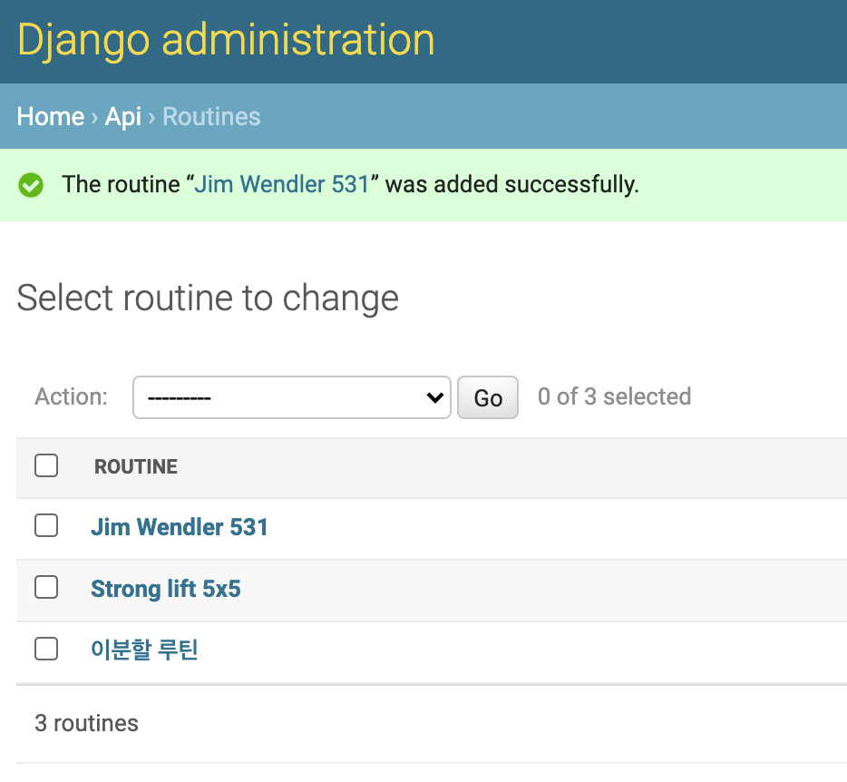

# django-rest-framework-12th

## 유의사항
* 본 레포지토리는 백엔드 스터디 2-3주차의 과제를 위한 레포입니다.
* 따라서 해당 레포를 fork 및 clone 후 local에서 본인의 깃헙 ID 브랜치로 작업한 후 커밋/푸시하고,
PR 보낼 때도 `본인의 브랜치-> 본인의 브랜치`로 해야 합니다.
 
## 2주차 과제 (기한: 9/26 토요일까지)
노션 링크 (https://www.notion.so/2-Django-ORM-c46e2d2f88ac4d948d012c07605d8e03)

### 서비스 설명
운동 플랜을 계획하고 이를 기록하는 서비스입니다.

### 모델 설명
Profile, Routine, History, MyTraining 4개의 모델을 생성했습니다.
- Profile
   - 유저의 정보가 담긴 모델입니다.
- Routine
    - 운동 플랜을 저장하는 모델입니다. 
    - Profile을 foreign key로 가집니다.
    - routineId와 data를 필드로 가집니다.
- History
    - 운동 기록을 저장하는 모델입니다.
    - Profile을 foreign key로 가집니다.
    - HistoryId와 data를 필드로 가집니다.
- MyTraining
    - 플랜 단위가 아닌 운동 단위로 기록해야할 것을 저장하는 모델입니다.
    - Profile을 foreign key로 가집니다.
    - myTrainingId와 data를 필드로 가집니다.
    
### ORM 적용해보기
shell에서 작성한 코드와 그 결과를 보여주세요! 
```mysql
# 유저 생성
>>> from django.contrib.auth.models import User
>>> User.objects.all()
<QuerySet []>
>>> User.objects.create(username='kkirru')
<User: kkirru>
>>> User.objects.all()
<QuerySet [<User: kkirru>]>

# Profile 모델 생성
>>> from api.models import Profile
>>> Profile.objects.create(user_id = 1, device_uid='fads5413', firebase_uid='fadslkj325978ajfs')
<Profile: Profile object (2)>
>>> Profile.objects.all()
<QuerySet [<Profile: Profile object (2)>]>
>>> Profile.objects.get(user_id=1)
<Profile: Profile object (2)>

# Routine 모델 생성
>>> from api.models import Routine
>>> Routine.objects.all()
<QuerySet []>
>>> Routine.objects.create(profile=me, routine_id=1, data='{name:"routine1"}')
<Routine: Routine object (1)>
>>> Routine.objects.create(profile=me, routine_id=2, data='{name:"routine2"}')
<Routine: Routine object (2)>
>>> Routine.objects.create(profile=me, routine_id=3, data='{name:"routine3"}')
<Routine: Routine object (3)>
>>> Routine.objects.all()
<QuerySet [<Routine: Routine object (1)>, <Routine: Routine object (2)>, <Routine: Routine object (3)>]>

# filter 함수 사
>>> Routine.objects.filter(profile=me)
<QuerySet [<Routine: Routine object (1)>, <Routine: Routine object (2)>, <Routine: Routine object (3)>]>
>>> Routine.objects.filter(routine_id=2)
<QuerySet [<Routine: Routine object (2)>]>
```


### 간단한 회고 
models.py를 작성할 때 데이터 타입 같은 것들을 일일이 찾아보는 과정이 쉽지 않았습니다!  
db 툴에서 드랍다운 등을 이용해서 테이블을 만드는 과정에 익숙해서 그런 것 같습니다.  
익숙해진다면 이런 방식으로 모델을 생성하고 db에 적용하는 방식이 더 편하게 느껴질 수 있을 것 같습니다!


## 3주차 과제 (기한: 10/3 토요일까지)
[과제 안내 노션](https://www.notion.so/3-DRF1-API-View-6d49c6ad888d4f249ffb52f0885c66d7)

### 모델 선택 및 데이터 삽입
선택한 모델의 구조와 데이터 삽입 후의 결과화면을 보여주세요!

선택한 모델 구조
```python
class Routine(models.Model):
    profile = models.ForeignKey('Profile', on_delete=models.CASCADE, related_name='routines')
    uuid = models.CharField(max_length=128)
    name = models.CharField(max_length=128, null=True, blank=True)
    bgImage = models.IntegerField(default=0)
    doneAt = models.DateTimeField(null=True, blank=True)

    def __str__(self):
        return self.name
```

3개의 데이터 삽입 


### 모든 list를 가져오는 API
API 요청한 URL과 결과 데이터를 코드로 보여주세요!

### 특정한 데이터를 가져오는 API
API 요청한 URL과 결과 데이터를 코드로 보여주세요!

### 새로운 데이터를 create하도록 요청하는 API
요청한 URL 및 Body 데이터의 내용과 create된 결과를 보여주세요!

### (선택) 특정 데이터를 삭제 또는 업데이트하는 API
위의 필수 과제와 마찬가지로 요청 URL 및 결과 데이터를 보여주세요!

### 공부한 내용 정리
새로 알게된 점, 정리 하고 싶은 개념, 궁금한점 등을 정리해 주세요

### 간단한 회고 
과제 시 어려웠던 점이나 느낀 점, 좋았던 점 등을 간단히 적어주세요!